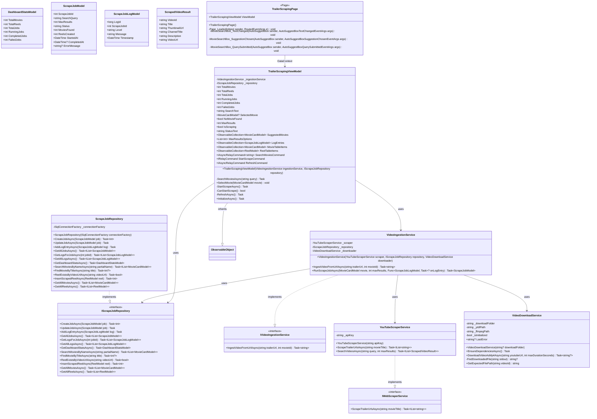

# Class Diagram — Andrei (Trailer Scraping)

```mermaid
classDiagram
    direction TB

    %% ── Models & DTOs ──
    class DashboardStatsModel {
        +int TotalMovies
        +int TotalReels
        +int TotalJobs
        +int RunningJobs
        +int CompletedJobs
        +int FailedJobs
    }

    class ScrapeJobModel {
        +int ScrapeJobId
        +string SearchQuery
        +int MaxResults
        +string Status
        +int MoviesFound
        +int ReelsCreated
        +DateTime StartedAt
        +DateTime? CompletedAt
        +string? ErrorMessage
    }

    class ScrapeJobLogModel {
        +long LogId
        +int ScrapeJobId
        +string Level
        +string Message
        +DateTime Timestamp
    }

    class ScrapedVideoResult {
        +string VideoId
        +string Title
        +string ThumbnailUrl
        +string ChannelTitle
        +string Description
        +string VideoUrl
    }

    %% ── Repositories ──
    class IScrapeJobRepository {
        <<interface>>
        +CreateJobAsync(ScrapeJobModel job) Task~int~
        +UpdateJobAsync(ScrapeJobModel job) Task
        +AddLogEntryAsync(ScrapeJobLogModel log) Task
        +GetAllJobsAsync() Task~IList~ScrapeJobModel~~
        +GetLogsForJobAsync(int jobId) Task~IList~ScrapeJobLogModel~~
        +GetAllLogsAsync() Task~IList~ScrapeJobLogModel~~
        +GetDashboardStatsAsync() Task~DashboardStatsModel~
        +SearchMoviesByNameAsync(string partialName) Task~IList~MovieCardModel~~
        +FindMovieByTitleAsync(string title) Task~int?~
        +ReelExistsByVideoUrlAsync(string videoUrl) Task~bool~
        +InsertScrapedReelAsync(ReelModel reel) Task~int~
        +GetAllMoviesAsync() Task~IList~MovieCardModel~~
        +GetAllReelsAsync() Task~IList~ReelModel~~
    }

    class ScrapeJobRepository {
        -ISqlConnectionFactory _connectionFactory
        +ScrapeJobRepository(ISqlConnectionFactory connectionFactory)
        +CreateJobAsync(ScrapeJobModel job) Task~int~
        +UpdateJobAsync(ScrapeJobModel job) Task
        +AddLogEntryAsync(ScrapeJobLogModel log) Task
        +GetAllJobsAsync() Task~IList~ScrapeJobModel~~
        +GetLogsForJobAsync(int jobId) Task~IList~ScrapeJobLogModel~~
        +GetAllLogsAsync() Task~IList~ScrapeJobLogModel~~
        +GetDashboardStatsAsync() Task~DashboardStatsModel~
        +SearchMoviesByNameAsync(string partialName) Task~IList~MovieCardModel~~
        +FindMovieByTitleAsync(string title) Task~int?~
        +ReelExistsByVideoUrlAsync(string videoUrl) Task~bool~
        +InsertScrapedReelAsync(ReelModel reel) Task~int~
        +GetAllMoviesAsync() Task~IList~MovieCardModel~~
        +GetAllReelsAsync() Task~IList~ReelModel~~
    }

    %% ── Services ──
    class IVideoIngestionService {
        <<interface>>
        +IngestVideoFromUrlAsync(string trailerUrl, int movieId) Task~string~
    }

    class VideoIngestionService {
        -YouTubeScraperService _scraper
        -IScrapeJobRepository _repository
        -VideoDownloadService _downloader
        +VideoIngestionService(YouTubeScraperService scraper, IScrapeJobRepository repository, VideoDownloadService downloader)
        +IngestVideoFromUrlAsync(string trailerUrl, int movieId) Task~string~
        +RunScrapeJobAsync(MovieCardModel movie, int maxResults, Func~ScrapeJobLogModel, Task~? onLogEntry) Task~ScrapeJobModel~
    }

    class IWebScraperService {
        <<interface>>
        +ScrapeTrailerUrlsAsync(string movieTitle) Task~IList~string~~
    }

    class YouTubeScraperService {
        -string _apiKey
        +YouTubeScraperService(string apiKey)
        +ScrapeTrailerUrlsAsync(string movieTitle) Task~IList~string~~
        +SearchVideosAsync(string query, int maxResults) Task~IList~ScrapedVideoResult~~
    }

    class VideoDownloadService {
        -string _downloadFolder
        -string _ytdlPath
        -string _ffmpegPath
        -bool _isInitialized
        +string? LastError
        +VideoDownloadService(string? downloadFolder)
        +EnsureDependenciesAsync() Task
        +DownloadVideoAsMp4Async(string youtubeUrl, int maxDurationSeconds) Task~string?~
        -FindDownloadedFile(string stdout) string?
        +GetExpectedFilePath(string videoId) string
    }

    %% ── ViewModel ──
    class TrailerScrapingViewModel {
        -VideoIngestionService _ingestionService
        -IScrapeJobRepository _repository
        +int TotalMovies
        +int TotalReels
        +int TotalJobs
        +int RunningJobs
        +int CompletedJobs
        +int FailedJobs
        +string SearchText
        +MovieCardModel? SelectedMovie
        +bool NoMovieFound
        +int MaxResults
        +bool IsScraping
        +string StatusText
        +ObservableCollection~MovieCardModel~ SuggestedMovies
        +List~int~ MaxResultsOptions
        +ObservableCollection~ScrapeJobLogModel~ LogEntries
        +ObservableCollection~MovieCardModel~ MovieTableItems
        +ObservableCollection~ReelModel~ ReelTableItems
        +IAsyncRelayCommand~string~ SearchMoviesCommand
        +IRelayCommand StartScrapeCommand
        +IAsyncRelayCommand RefreshCommand
        +TrailerScrapingViewModel(VideoIngestionService ingestionService, IScrapeJobRepository repository)
        -SearchMoviesAsync(string query) Task
        +SelectMovie(MovieCardModel movie) void
        -StartScrapeAsync() Task
        -CanStartScrape() bool
        -RefreshAsync() Task
        +InitializeAsync() Task
    }

    %% ── View ──
    class TrailerScrapingPage {
        <<Page>>
        +TrailerScrapingViewModel ViewModel
        +TrailerScrapingPage()
        -Page_Loaded(object sender, RoutedEventArgs e) void
        -MovieSearchBox_TextChanged(AutoSuggestBox sender, AutoSuggestBoxTextChangedEventArgs args) void
        -MovieSearchBox_SuggestionChosen(AutoSuggestBox sender, AutoSuggestBoxSuggestionChosenEventArgs args) void
        -MovieSearchBox_QuerySubmitted(AutoSuggestBox sender, AutoSuggestBoxQuerySubmittedEventArgs args) void
    }

    %% ── Relationships ──
    TrailerScrapingViewModel --|> ObservableObject : inherits
    ScrapeJobRepository ..|> IScrapeJobRepository : implements
    VideoIngestionService ..|> IVideoIngestionService : implements
    YouTubeScraperService ..|> IWebScraperService : implements
    
    VideoIngestionService --> YouTubeScraperService : uses
    VideoIngestionService --> IScrapeJobRepository : uses
    VideoIngestionService --> VideoDownloadService : uses

    TrailerScrapingPage --> TrailerScrapingViewModel : DataContext
    TrailerScrapingViewModel --> VideoIngestionService : uses
    TrailerScrapingViewModel --> IScrapeJobRepository : uses
```
