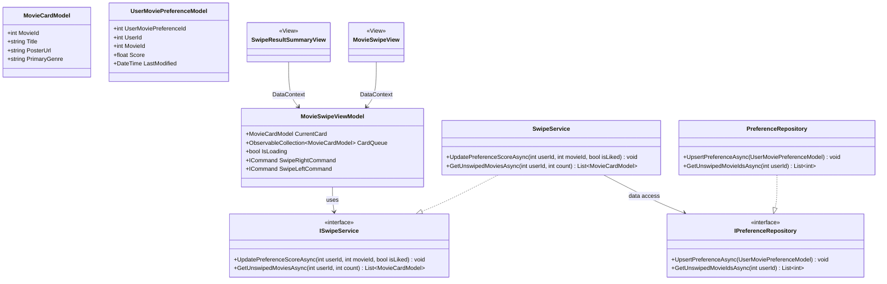

# Class Diagram — Bogdan (Movie Swipe)

```mermaid
classDiagram
    direction TB

    %% ── Models ──
    class MovieCardModel {
        +int MovieId
        +string Title
        +string PosterUrl
        +string PrimaryGenre
    }

    class UserMoviePreferenceModel {
        +int UserMoviePreferenceId
        +int UserId
        +int MovieId
        +float Score
        +DateTime LastModified
    }

    %% ── Services ──
    class ISwipeService {
        <<interface>>
        +UpdatePreferenceScoreAsync(int userId, int movieId, bool isLiked) void
        +GetUnswipedMoviesAsync(int userId, int count) List~MovieCardModel~
    }

    class SwipeService {
        +UpdatePreferenceScoreAsync(int userId, int movieId, bool isLiked) void
        +GetUnswipedMoviesAsync(int userId, int count) List~MovieCardModel~
    }

    class IPreferenceRepository {
        <<interface>>
        +UpsertPreferenceAsync(UserMoviePreferenceModel) void
        +GetUnswipedMovieIdsAsync(int userId) List~int~
    }

    class PreferenceRepository {
        +UpsertPreferenceAsync(UserMoviePreferenceModel) void
        +GetUnswipedMovieIdsAsync(int userId) List~int~
    }

    %% ── ViewModel ──
    class MovieSwipeViewModel {
        +MovieCardModel CurrentCard
        +ObservableCollection~MovieCardModel~ CardQueue
        +bool IsLoading
        +ICommand SwipeRightCommand
        +ICommand SwipeLeftCommand
    }

    %% ── Views ──
    class MovieSwipeView {
        <<View>>
    }

    class SwipeResultSummaryView {
        <<View>>
    }

    %% ── Relationships ──
    SwipeService ..|> ISwipeService
    PreferenceRepository ..|> IPreferenceRepository
    MovieSwipeView --> MovieSwipeViewModel : DataContext
    SwipeResultSummaryView --> MovieSwipeViewModel : DataContext

    MovieSwipeViewModel --> ISwipeService : uses
    SwipeService --> IPreferenceRepository : data access
```
