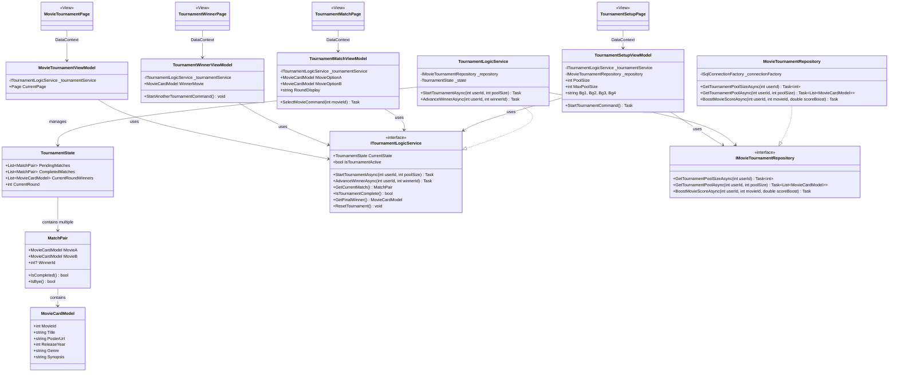

# Class Diagram — Gabi (Movie Tournament)

## Layer Summary

| Layer | Component | Description |
|---|---|---|
| **Models** | `MovieCardModel` | Shared core model for movie information. |
| | `MatchPair` | Represent a head-to-head match between two movies. |
| | `TournamentState` | Snapshot of the active tournament (pending/completed matches). |
| **Services** | `TournamentLogicService` | Core logic for bracket generation and advancing winners. |
| **Repos** | `MovieTournamentRepository` | SQL-based data access for user preferences and pool selection. |
| **ViewModels** | `Tournament...ViewModel` | Logic for Setup, Match-ups, and the Winner screen. |
| **Views** | `Tournament...Page` | WinUI 3 pages providing the user interface. |
