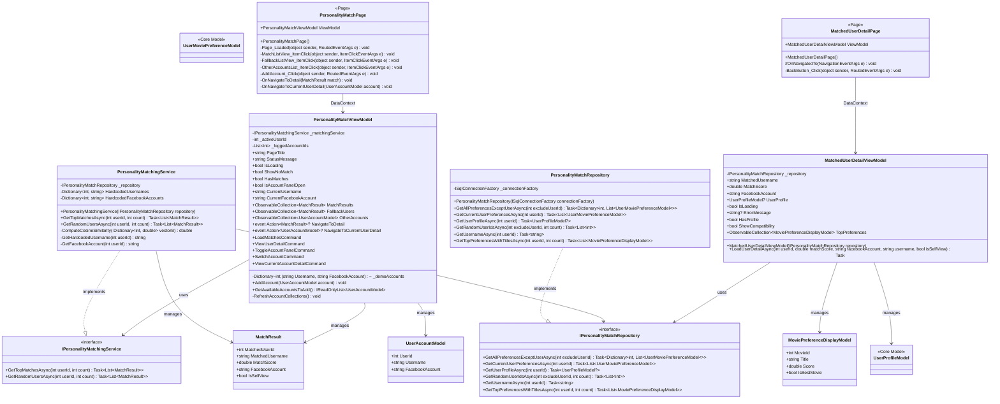

# Class Diagram — Madi (Personality Match)

```mermaid
classDiagram
    direction TB

    %% ── Models ──
    class MatchResult {
        +int MatchedUserId
        +string MatchedUsername
        +double MatchScore
        +string FacebookAccount
        +bool IsSelfView
    }

    class MoviePreferenceDisplayModel {
        +int MovieId
        +string Title
        +double Score
        +bool IsBestMovie
    }

    class UserAccountModel {
        +int UserId
        +string Username
        +string FacebookAccount
    }

    class UserProfileModel {
        <<Core Model>>
    }

    class UserMoviePreferenceModel {
        <<Core Model>>
    }

    %% ── Repositories ──
    class IPersonalityMatchRepository {
        <<interface>>
        +GetAllPreferencesExceptUserAsync(int excludeUserId) Task~Dictionary~int, List~UserMoviePreferenceModel~~~
        +GetCurrentUserPreferencesAsync(int userId) Task~List~UserMoviePreferenceModel~~
        +GetUserProfileAsync(int userId) Task~UserProfileModel?~
        +GetRandomUserIdsAsync(int excludeUserId, int count) Task~List~int~~
        +GetUsernameAsync(int userId) Task~string~
        +GetTopPreferencesWithTitlesAsync(int userId, int count) Task~List~MoviePreferenceDisplayModel~~
    }

    class PersonalityMatchRepository {
        -ISqlConnectionFactory _connectionFactory
        +PersonalityMatchRepository(ISqlConnectionFactory connectionFactory)
        +GetAllPreferencesExceptUserAsync(int excludeUserId) Task~Dictionary~int, List~UserMoviePreferenceModel~~~
        +GetCurrentUserPreferencesAsync(int userId) Task~List~UserMoviePreferenceModel~~
        +GetUserProfileAsync(int userId) Task~UserProfileModel?~
        +GetRandomUserIdsAsync(int excludeUserId, int count) Task~List~int~~
        +GetUsernameAsync(int userId) Task~string~
        +GetTopPreferencesWithTitlesAsync(int userId, int count) Task~List~MoviePreferenceDisplayModel~~
    }

    %% ── Services ──
    class IPersonalityMatchingService {
        <<interface>>
        +GetTopMatchesAsync(int userId, int count) Task~List~MatchResult~~
        +GetRandomUsersAsync(int userId, int count) Task~List~MatchResult~~
    }

    class PersonalityMatchingService {
        -IPersonalityMatchRepository _repository
        -Dictionary~int, string~ HardcodedUsernames
        -Dictionary~int, string~ HardcodedFacebookAccounts
        +PersonalityMatchingService(IPersonalityMatchRepository repository)
        +GetTopMatchesAsync(int userId, int count) Task~List~MatchResult~~
        +GetRandomUsersAsync(int userId, int count) Task~List~MatchResult~~
        -ComputeCosineSimilarity(Dictionary~int, double~ vectorA, Dictionary~int, double~ vectorB) double
        -GetHardcodedUsername(int userId) string
        -GetFacebookAccount(int userId) string
    }

    %% ── ViewModels ──
    class PersonalityMatchViewModel {
        -IPersonalityMatchingService _matchingService
        -Dictionary~int, (string Username, string FacebookAccount)~ _demoAccounts
        -int _activeUserId
        -List~int~ _loggedAccountIds
        +string PageTitle
        +string StatusMessage
        +bool IsLoading
        +bool ShowNoMatch
        +bool HasMatches
        +bool IsAccountPanelOpen
        +string CurrentUsername
        +string CurrentFacebookAccount
        +ObservableCollection~MatchResult~ MatchResults
        +ObservableCollection~MatchResult~ FallbackUsers
        +ObservableCollection~UserAccountModel~ OtherAccounts
        +event Action~MatchResult~? NavigateToDetail
        +event Action~UserAccountModel~? NavigateToCurrentUserDetail
        +LoadMatchesCommand
        +ViewUserDetailCommand
        +ToggleAccountPanelCommand
        +SwitchAccountCommand
        +ViewCurrentAccountDetailCommand
        +AddAccount(UserAccountModel account) void
        +GetAvailableAccountsToAdd() IReadOnlyList~UserAccountModel~
        -RefreshAccountCollections() void
    }

    class MatchedUserDetailViewModel {
        -IPersonalityMatchRepository _repository
        +string MatchedUsername
        +double MatchScore
        +string FacebookAccount
        +UserProfileModel? UserProfile
        +bool IsLoading
        +string? ErrorMessage
        +bool HasProfile
        +bool ShowCompatibility
        +ObservableCollection~MoviePreferenceDisplayModel~ TopPreferences
        +MatchedUserDetailViewModel(IPersonalityMatchRepository repository)
        +LoadUserDetailAsync(int userId, double matchScore, string facebookAccount, string username, bool isSelfView) Task
    }

    %% ── Views ──
    class PersonalityMatchPage {
        <<Page>>
        +PersonalityMatchViewModel ViewModel
        +PersonalityMatchPage()
        -Page_Loaded(object sender, RoutedEventArgs e) void
        -MatchListView_ItemClick(object sender, ItemClickEventArgs e) void
        -FallbackListView_ItemClick(object sender, ItemClickEventArgs e) void
        -OtherAccountsList_ItemClick(object sender, ItemClickEventArgs e) void
        -AddAccount_Click(object sender, RoutedEventArgs e) void
        -OnNavigateToDetail(MatchResult match) void
        -OnNavigateToCurrentUserDetail(UserAccountModel account) void
    }

    class MatchedUserDetailPage {
        <<Page>>
        +MatchedUserDetailViewModel ViewModel
        +MatchedUserDetailPage()
        #OnNavigatedTo(NavigationEventArgs e) void
        -BackButton_Click(object sender, RoutedEventArgs e) void
    }

    %% ── Relationships ──
    PersonalityMatchRepository ..|> IPersonalityMatchRepository : implements
    PersonalityMatchingService ..|> IPersonalityMatchingService : implements
    
    PersonalityMatchingService --> IPersonalityMatchRepository : uses
    PersonalityMatchingService --> MatchResult : manages

    PersonalityMatchViewModel --> IPersonalityMatchingService : uses
    PersonalityMatchViewModel --> MatchResult : manages
    PersonalityMatchViewModel --> UserAccountModel : manages

    MatchedUserDetailViewModel --> IPersonalityMatchRepository : uses
    MatchedUserDetailViewModel --> MoviePreferenceDisplayModel : manages
    MatchedUserDetailViewModel --> UserProfileModel : manages

    PersonalityMatchPage --> PersonalityMatchViewModel : DataContext
    MatchedUserDetailPage --> MatchedUserDetailViewModel : DataContext
```