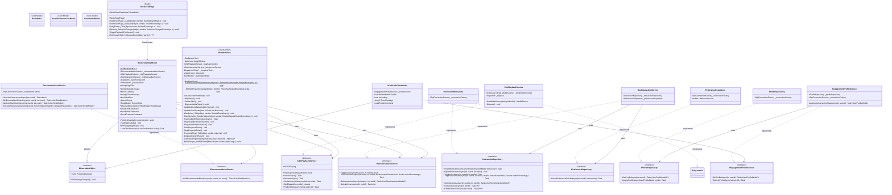

# Class Diagram — Tudor (Reels Feed)

```mermaid
classDiagram
    direction TB

    %% ── Models ──
    class ReelModel {
        <<Core Model>>
    }

    class UserReelInteractionModel {
        <<Core Model>>
    }

    class UserProfileModel {
        <<Core Model>>
    }

    %% ── Repositories ──
    class IInteractionRepository {
        <<interface>>
        +InsertInteractionAsync(UserReelInteractionModel interaction) Task
        +UpsertInteractionAsync(int userId, int reelId) Task
        +ToggleLikeAsync(int userId, int reelId) Task
        +UpdateViewDataAsync(int userId, int reelId, double watchDurationSec, double watchPercentage) Task
        +GetInteractionAsync(int userId, int reelId) Task~UserReelInteractionModel?~
        +GetLikeCountAsync(int reelId) Task~int~
        +GetReelMovieIdAsync(int reelId) Task~int?~
    }

    class InteractionRepository {
        -ISqlConnectionFactory _connectionFactory
    }

    class IPreferenceRepository {
        <<interface>>
        +BoostPreferenceOnLikeAsync(int userId, int movieId) Task
    }

    class PreferenceRepository {
        -ISqlConnectionFactory _connectionFactory
        -double LikeBoostAmount
    }

    class IProfileRepository {
        <<interface>>
        +GetProfileAsync(int userId) Task~UserProfileModel?~
        +UpsertProfileAsync(UserProfileModel profile) Task
    }

    class ProfileRepository {
        -ISqlConnectionFactory _connectionFactory
    }

    %% ── Services ──
    class IClipPlaybackService {
        <<interface>>
        +bool IsPlaying
        +PlayAsync(string videoUrl) Task
        +PauseAsync() Task
        +ResumeAsync() Task
        +SeekAsync(double positionSeconds) Task
        +GetElapsedSeconds() double
        +PrefetchClipAsync(string videoUrl) Task
    }

    class ClipPlaybackService {
        -Dictionary~string, MediaSource~ _prefetchedSources
        -Stopwatch _elapsed
        +GetMediaSource(string videoUrl) MediaSource
        +Dispose() void
    }

    class IEngagementProfileService {
        <<interface>>
        +GetProfileAsync(int userId) Task~UserProfileModel?~
        +RefreshProfileAsync(int userId) Task
    }

    class EngagementProfileService {
        -IProfileRepository _profileRepository
        -ISqlConnectionFactory _connectionFactory
        -AggregateInteractionStatsAsync(int userId) Task~UserProfileModel~
    }

    class IRecommendationService {
        <<interface>>
        +GetRecommendedReelsAsync(int userId, int count) Task~IList~ReelModel~~
    }

    class RecommendationService {
        -ISqlConnectionFactory _connectionFactory
        -UserHasPreferencesAsync(int userId) Task~bool~
        -GetPersonalizedReelsAsync(int userId, int count) Task~IList~ReelModel~~
        -GetColdStartReelsAsync(int userId, int count) Task~IList~ReelModel~~
        -ExecuteReelQueryAsync(string sql, Action~SqlCommand~ configureParameters) Task~IList~ReelModel~~
    }

    class IReelInteractionService {
        <<interface>>
        +ToggleLikeAsync(int userId, int reelId) Task
        +RecordViewAsync(int userId, int reelId, double watchDurationSec, double watchPercentage) Task
        +GetInteractionAsync(int userId, int reelId) Task~UserReelInteractionModel?~
        +GetLikeCountAsync(int reelId) Task~int~
    }

    class ReelInteractionService {
        -IInteractionRepository _interactionRepository
        -IPreferenceRepository _preferenceRepository
    }

    %% ── ViewModels ──
    class ObservableObject {
        <<abstract>>
        +event PropertyChanged
        #OnPropertyChanged() void
    }

    class ReelsFeedViewModel {
        -int MockUserId = 1$
        -IRecommendationService _recommendationService
        -IClipPlaybackService _clipPlaybackService
        -IReelInteractionService _reelInteractionService
        -Stopwatch _watchStopwatch
        -ReelModel? _previousReel
        +string PageTitle
        +string StatusMessage
        +bool IsLoading
        +string? ErrorMessage
        +bool HasError
        +bool IsEmpty
        +ReelModel? CurrentReel
        +ObservableCollection~ReelModel~ ReelQueue
        +LoadFeedCommand
        +ScrollNextCommand
        +ScrollPreviousCommand
        -PrefetchNearby(int currentIndex) void
        -FlushWatchData() void
        +OnNavigatingAway() void
        -LoadLikeDataAsync(IList~ReelModel~ reels) Task
    }

    class UserProfileViewModel {
        -IEngagementProfileService _profileService
        +UserProfileModel? Profile
        +bool IsLoading
        +string? ErrorMessage
        +LoadProfileCommand
    }

    %% ── Views ──
    class ReelsFeedPage {
        <<Page>>
        +ReelsFeedViewModel ViewModel
        +ReelsFeedPage()
        -ReelsFeedPage_Loaded(object sender, RoutedEventArgs e) void
        -ReelsFeedPage_Unloaded(object sender, RoutedEventArgs e) void
        -RetryButton_Click(object sender, RoutedEventArgs e) void
        -FlipView_SelectionChanged(object sender, SelectionChangedEventArgs e) void
        -TriggerPlaybackForCurrent() void
        -FindVisualChild~T~(DependencyObject parent) T?
    }

    class ReelItemView {
        <<UserControl>>
        +ReelModel Reel
        +static bool IsAppClosing
        -IClipPlaybackService _playbackService
        -IReelInteractionService _interactionService
        -DispatcherTimer? _progressTimer
        -volatile bool _disposed
        -ReelModel? _subscribedReel
        +ReelItemView()
        -OnReelChanged(DependencyObject d, DependencyPropertyChangedEventArgs e) void$
        -OnReelPropertyChanged(object sender, PropertyChangedEventArgs args) void
        -UnsubscribeFromReel() void
        +PlayVideo() void
        +PauseVideo() void
        +DisposeMediaPlayer() void
        -UpdateGenreBadge(string? genre) void
        -UpdateLikeVisuals(bool isLiked, int likeCount) void
        -LikeButton_Click(object sender, RoutedEventArgs e) void
        -ReelItemView_DoubleTapped(object sender, DoubleTappedRoutedEventArgs e) void
        -ToggleLikeWithAnimationAsync() Task
        -PlayHeartBounceAnimation() void
        -PlayHeartBurstAnimation() void
        -StartProgressTimer() void
        -StopProgressTimer() void
        -ProgressTimer_Tick(object sender, object e) void
        -DisposeCurrentPlayer() void
        -GetParentFlipView(DependencyObject element) FlipView?
        -MediaPlayer_MediaEnded(MediaPlayer sender, object args) void
    }

    %% ── Relationships ──
    InteractionRepository ..|> IInteractionRepository : implements
    PreferenceRepository ..|> IPreferenceRepository : implements
    ProfileRepository ..|> IProfileRepository : implements

    ClipPlaybackService ..|> IClipPlaybackService : implements
    ClipPlaybackService ..|> IDisposable : implements

    EngagementProfileService ..|> IEngagementProfileService : implements
    EngagementProfileService --> IProfileRepository : uses

    RecommendationService ..|> IRecommendationService : implements
    ReelInteractionService ..|> IReelInteractionService : implements
    ReelInteractionService --> IInteractionRepository : uses
    ReelInteractionService --> IPreferenceRepository : uses

    ReelsFeedViewModel --|> ObservableObject : inherits
    UserProfileViewModel --|> ObservableObject : inherits

    ReelsFeedViewModel --> IRecommendationService : uses
    ReelsFeedViewModel --> IClipPlaybackService : uses
    ReelsFeedViewModel --> IReelInteractionService : uses

    UserProfileViewModel --> IEngagementProfileService : uses

    ReelsFeedPage --> ReelsFeedViewModel : DataContext
    ReelItemView --> IClipPlaybackService : uses
    ReelItemView --> IReelInteractionService : uses
```
