# UML Class Diagram — Movie & Personality Application (MVVM)

```mermaid
classDiagram
    direction TB

    %% ══════════════════════════════════════
    %%  SHARED MODELS (Database-backed)
    %% ══════════════════════════════════════

    class ReelModel {
        +int ReelId
        +int? MovieId
        +int? CreatorUserId
        +string VideoUrl
        +string ThumbnailUrl
        +string Title
        +string Caption
        +int DurationSeconds
        +string? CropDataJson
        +int? BackgroundMusicId
        +string Source
        +DateTime CreatedAt
        +DateTime? LastEditedAt
    }

    class UserMoviePreferenceModel {
        +int UserMoviePreferenceId
        +int UserId
        +int MovieId
        +float Score
        +DateTime LastModified
    }

    class UserProfileModel {
        +int UserProfileId
        +int UserId
        +int TotalLikes
        +long TotalWatchTimeSec
        +float AvgWatchTimeSec
        +int TotalClipsViewed
        +float LikeToViewRatio
        +DateTime LastUpdated
    }

    class UserReelInteractionModel {
        +int InteractionId
        +int UserId
        +int ReelId
        +bool IsLiked
        +int? WatchDurationSec
        +float? WatchPercentage
        +DateTime ViewedAt
    }

    class MusicTrackModel {
        +int MusicTrackId
        +string TrackName
        +string AudioUrl
        +int DurationSeconds
    }

    class MovieCardModel {
        +int MovieId
        +string Title
        +string PosterUrl
        +string PrimaryGenre
    }

    class MovieModel {
        +int MovieId
        +string Title
        +string PosterUrl
    }

    %% ══════════════════════════════════════
    %%  IN-MEMORY / DTOs
    %% ══════════════════════════════════════

    class TournamentState {
        +List~Matchup~ PendingMatches
        +List~Matchup~ CompletedMatches
        +int CurrentRound
    }

    class MatchPair {
        +MovieCardModel MovieA
        +MovieCardModel MovieB
        +int? WinnerId
    }

    class MatchResult {
        +int MatchedUserId
        +string MatchedUsername
        +float MatchScore
    }

    class ReelUploadRequest {
        +Stream VideoFileStream
        +string FileName
        +int UploaderUserId
        +int? MovieId
        +string? Caption
    }

    class VideoEditMetadata {
        +int CropX
        +int CropY
        +int CropWidth
        +int CropHeight
        +int? SelectedMusicTrackId
    }

    TournamentState --> "contains multiple" MatchPair
    MatchPair --> "contains 2" MovieCardModel

    %% ══════════════════════════════════════
    %%  SERVICES & REPOSITORIES
    %% ══════════════════════════════════════


    class IUserSession {
        <<interface>>
        +int CurrentUserId
        +bool IsAuthenticated
    }

    class IReelRepository {
        <<interface>>
        +InsertReelAsync(ReelModel) void
        +BulkInsertScrapedReelsAsync(List~ReelModel~) void
        +UpdateReelCropAndMusicAsync(int reelId, string cropJson, int musicId) void
        +GetReelsByUserIdAsync(int userId) List~ReelModel~
        +GetReelsByMovieIdAsync(int movieId, string source) List~ReelModel~
    }

    class IMusicTrackRepository {
        <<interface>>
        +GetAllTracksAsync() List~MusicTrackModel~
    }

    class IPreferenceRepository {
        <<interface>>
        +UpsertPreferenceAsync(UserMoviePreferenceModel) void
        +GetAllPreferencesExceptUserAsync(int excludeUserId) Dictionary~int, List~UserMoviePreferenceModel~~
        +GetUnswipedMovieIdsAsync(int userId) List~int~
    }

    class IUserProfileRepository {
        <<interface>>
        +GetProfileAsync(int userId) UserProfileModel
        +UpsertProfileAsync(UserProfileModel) void
    }

    class IUserReelInteractionRepository {
        <<interface>>
        +InsertInteractionAsync(UserReelInteractionModel) void
        +UpdateLikeStatusAsync(int interactionId, bool isLiked) void
    }

    class IMovieRepository {
        <<interface>>
        +GetRandomMoviesAsync(int count) List~MovieModel~
    }


    class IVideoStorageService {
        <<interface>>
        +UploadVideoAsync(ReelUploadRequest) ReelModel
        +ValidateVideoAsync(Stream) ValidationResult
    }

    class IWebScraperService {
        <<interface>>
        +ScrapeVideosForMovieAsync(string movieTitle) List~RawVideo~
    }

    class VideoIngestionService {
        +IngestTrailersAsync() void
    }

    class WebScraperBackgroundService {
        +ExecuteAsync() void
    }

    class IVideoProcessingService {
        <<interface>>
        +ApplyCrop(VideoEditMetadata) void
        +MergeAudioTrack(int reelId, int musicTrackId) void
    }

    class IAudioLibraryService {
        <<interface>>
        +GetAvailableTracksAsync() List~MusicTrackModel~
    }

    class ISwipeService {
        <<interface>>
        +UpdatePreferenceScoreAsync(int userId, int movieId, bool isLiked) void
        +GetUnswipedMoviesAsync(int userId, int count) List~MovieCardModel~
    }

    class SwipeService {
        +UpdatePreferenceScoreAsync(int userId, int movieId, bool isLiked) void
        +GetUnswipedMoviesAsync(int userId, int count) List~MovieCardModel~
    }

    class ITournamentLogicService {
        <<interface>>
        +TournamentState CurrentState
        +bool IsTournamentActive
        +StartTournamentAsync(int userId, int poolSize) void
        +AdvanceWinnerAsync(int userId, int winnerId) void
        +ResetTournament() void
        +GetCurrentMatch() MatchPair
        +IsTournamentComplete() bool
        +GetFinalWinner() MovieCardModel
    }

    class TournamentLogicService {
        +TournamentState CurrentState
        +bool IsTournamentActive
        +StartTournamentAsync(int userId, int poolSize) void
        +AdvanceWinnerAsync(int userId, int winnerId) void
        +ResetTournament() void
        +GetCurrentMatch() MatchPair
        +IsTournamentComplete() bool
        +GetFinalWinner() MovieCardModel
    }
    
    class IMovieTournamentRepository {
        <<interface>>
        +GetTournamentPoolSizeAsync(userId: int) int
        +GetTournamentPoolAsync(userId: int, poolSize: int) List~MovieCardModel~
        +BoostMovieScoreAsync(userId: int, movieId: int, scoreBoost: double) void
    }
    
    class MovieTournamentRepository {
        +GetTournamentPoolSizeAsync(userId: int) int
        +GetTournamentPoolAsync(userId: int, poolSize: int) List~MovieCardModel~
        +BoostMovieScoreAsync(userId: int, movieId: int, scoreBoost: double) void
    }

    class IPersonalityMatchingService {
        <<interface>>
        +GetTopMatchesAsync(int userId, int limit) List~MatchResult~
    }

    class IReelInteractionService {
        <<interface>>
        +RecordViewAsync(int userId, int reelId, int watchDuration, float watchPct) void
        +ToggleLikeAsync(int userId, int reelId) void
        +GetInteractionAsync(int userId, int reelId) UserReelInteractionModel
    }

    class IEngagementProfileService {
        <<interface>>
        +RecalculateProfileAsync(int userId) void
        +GetProfileAsync(int userId) UserProfileModel
    }

    class IRecommendationService {
        <<interface>>
        +GetRecommendedReelsAsync(int userId, int count) List~ReelModel~
    }

    class IClipPlaybackService {
        <<interface>>
        +PlayClip(string videoUrl) void
        +PauseClip() void
        +ResumeClip() void
        +GetElapsedSeconds() int
        +PrefetchClip(string videoUrl) void
    }

    SwipeService ..|> ISwipeService
    VideoIngestionService --> IWebScraperService
    TournamentLogicService ..|> ITournamentLogicService
    MovieTournamentRepository ..|> IMovieTournamentRepository
    TournamentLogicService --> IMovieTournamentRepository
    TournamentLogicService --> TournamentState

    %% ══════════════════════════════════════
    %%  VIEWMODELS
    %% ══════════════════════════════════════

    class ViewModelBase {
        <<abstract>>
        +event PropertyChanged
        #OnPropertyChanged() void
    }

    class ReelUploadViewModel {
        +string SelectedFilePath
        +string StatusMessage
        +bool IsUploading
        +int? SelectedMovieId
        +ICommand PickFileCommand
        +ICommand SubmitUploadCommand
    }

    class MovieTrailerPlayerViewModel {
        +ObservableCollection~ReelModel~ Trailers
        +string SelectedVideoUrl
        +LoadTrailersCommand(int movieId)
    }

    class ReelGalleryViewModel {
        +ObservableCollection~ReelModel~ UserReels
        +ICommand LoadReelsCommand
    }

    class ReelEditorViewModel {
        +ReelModel SelectedReel
        +VideoEditMetadata CurrentEdits
        +MusicTrackModel? SelectedMusicTrack
        +ICommand SaveEditsCommand
    }

    class MusicSelectionDialogViewModel {
        +ObservableCollection~MusicTrackModel~ AvailableTracks
        +ICommand SelectTrackCommand
    }

    class MovieSwipeViewModel {
        +MovieCardModel CurrentCard
        +ObservableCollection~MovieCardModel~ CardQueue
        +bool IsLoading
        +ICommand SwipeRightCommand
        +ICommand SwipeLeftCommand
    }

    class TournamentSetupViewModel {
        +int PoolSize
        +int MaxPoolSize
        +string SetupErrorMessage
        +string Bg1
        +string Bg2
        +string Bg3
        +string Bg4
        +ICommand StartTournamentCommand
        +event TournamentStarted
    }

    class TournamentMatchViewModel {
        +MovieCardModel MovieOptionA
        +MovieCardModel MovieOptionB
        +int RoundNumber
        +string RoundDisplay
        +ICommand SelectMovieCommand
        +ICommand GoBackCommand
        +event TournamentComplete
        +event NavigateBack
    }

    class TournamentWinnerViewModel {
        +MovieCardModel WinnerMovie
        +ICommand StartAnotherTournamentCommand
        +event NavigateToSetup
    }

    class MatchListViewModel {
        +ObservableCollection~MatchResult~ MatchResults
        +bool IsLoading
        +ICommand LoadMatchesCommand
    }

    class MatchedUserDetailViewModel {
        +UserProfileModel MatchedUserProfile
        +List~UserMoviePreferenceModel~ TopPreferences
        +float CompatibilityScore
    }

    class ReelsFeedViewModel {
        +ReelModel CurrentReel
        +ObservableCollection~ReelModel~ ReelQueue
        +bool IsLoading
        +bool IsCurrentReelLiked
        +string? ErrorMessage
        +ICommand LoadFeedCommand
        +ICommand ScrollNextCommand
        +ICommand ScrollPreviousCommand
        +ICommand ToggleLikeCommand
    }

    class UserProfileViewModel {
        +UserProfileModel Profile
    }

    ReelUploadViewModel --|> ViewModelBase
    MovieTrailerPlayerViewModel --|> ViewModelBase
    ReelGalleryViewModel --|> ViewModelBase
    ReelEditorViewModel --|> ViewModelBase
    MusicSelectionDialogViewModel --|> ViewModelBase
    MovieSwipeViewModel --|> ViewModelBase
    TournamentSetupViewModel --|> ViewModelBase
    TournamentMatchViewModel --|> ViewModelBase
    TournamentWinnerViewModel --|> ViewModelBase
    MatchListViewModel --|> ViewModelBase
    MatchedUserDetailViewModel --|> ViewModelBase
    ReelsFeedViewModel --|> ViewModelBase
    UserProfileViewModel --|> ViewModelBase

    %% ── ViewModel → Service dependencies ──
    ReelUploadViewModel --> IVideoStorageService
    ReelUploadViewModel --> IUserSession
    MovieTrailerPlayerViewModel --> IReelRepository
    ReelGalleryViewModel --> IReelRepository
    ReelGalleryViewModel --> IUserSession
    ReelEditorViewModel --> IVideoProcessingService
    ReelEditorViewModel --> IReelRepository
    MusicSelectionDialogViewModel --> IAudioLibraryService
    MovieSwipeViewModel --> ISwipeService
    MovieSwipeViewModel --> IUserSession
    TournamentSetupViewModel --> ITournamentLogicService
    TournamentSetupViewModel --> IMovieTournamentRepository
    TournamentMatchViewModel --> ITournamentLogicService
    TournamentWinnerViewModel --> ITournamentLogicService


    MatchListViewModel --> IPersonalityMatchingService
    MatchedUserDetailViewModel --> IEngagementProfileService
    ReelsFeedViewModel --> IReelInteractionService
    ReelsFeedViewModel --> IRecommendationService
    ReelsFeedViewModel --> IClipPlaybackService
    UserProfileViewModel --> IEngagementProfileService

    %% ── Service → Repository dependencies ──
    SwipeService --> IPreferenceRepository
    SwipeService --> IMovieRepository
    VideoIngestionService --> IReelRepository
    PersonalityMatchingService --> IPreferenceRepository
    PersonalityMatchingService --> IUserProfileRepository
    ReelInteractionService --> IUserReelInteractionRepository
    EngagementProfileService --> IUserProfileRepository
    IAudioLibraryService --> IMusicTrackRepository

    %% ══════════════════════════════════════
    %%  VIEWS
    %% ══════════════════════════════════════

    class ReelUploadView {
        <<View>>
    }

    class MovieTrailerPlayerView {
        <<View>>
    }

    class ReelGalleryView {
        <<View>>
    }

    class ReelEditorView {
        <<View>>
    }

    class MusicSelectionDialogView {
        <<View>>
    }

    class MovieSwipeView {
        <<View>>
    }

    class SwipeResultSummaryView {
        <<View>>
    }

    class TournamentSetupPage {
        <<View>>
    }

    class TournamentMatchPage {
        <<View>>
    }

    class TournamentWinnerPage {
        <<View>>
    }
    
    class MovieTournamentPage {
        <<View>>
    }

    class MatchListView {
        <<View>>
    }

    class MatchedUserDetailView {
        <<View>>
    }

    class ReelsFeedView {
        <<View>>
    }

    class ReelItemView {
        <<View>>
    }

    %% ── View → ViewModel bindings ──
    ReelUploadView --> ReelUploadViewModel
    MovieTrailerPlayerView --> MovieTrailerPlayerViewModel
    ReelGalleryView --> ReelGalleryViewModel
    ReelEditorView --> ReelEditorViewModel
    MusicSelectionDialogView --> MusicSelectionDialogViewModel
    MovieSwipeView --> MovieSwipeViewModel
    SwipeResultSummaryView --> MovieSwipeViewModel
    TournamentSetupPage --> TournamentSetupViewModel
    TournamentMatchPage --> TournamentMatchViewModel
    TournamentWinnerPage --> TournamentWinnerViewModel
    MatchListView --> MatchListViewModel
    MatchedUserDetailView --> MatchedUserDetailViewModel
    ReelsFeedView --> ReelsFeedViewModel
    ReelItemView --> ReelsFeedViewModel
```

## MVVM Layer Summary

| Layer | Count | Components |
|---|---|---|
| **Models** | 12 | `ReelModel`, `UserMoviePreferenceModel`, `UserProfileModel`, `UserReelInteractionModel`, `MusicTrackModel`, `MovieCardModel`, `MovieModel`, `TournamentState`, `MatchPair`, `MatchResult`, `ReelUploadRequest`, `VideoEditMetadata` |
| **Views** | 15 | `ReelUploadView`, `MovieTrailerPlayerView`, `ReelGalleryView`, `ReelEditorView`, `MusicSelectionDialogView`, `MovieSwipeView`, `SwipeResultSummaryView`, `TournamentSetupPage`, `TournamentMatchPage`, `TournamentWinnerPage`, `MovieTournamentPage`, `MatchListView`, `MatchedUserDetailView`, `ReelsFeedView`, `ReelItemView` |
| **ViewModels** | 13 | `ReelUploadViewModel`, `MovieTrailerPlayerViewModel`, `ReelGalleryViewModel`, `ReelEditorViewModel`, `MusicSelectionDialogViewModel`, `MovieSwipeViewModel`, `TournamentSetupViewModel`, `TournamentMatchViewModel`, `TournamentWinnerViewModel`, `MatchListViewModel`, `MatchedUserDetailViewModel`, `ReelsFeedViewModel`, `UserProfileViewModel` (All inherit from `ViewModelBase`) |
| **Services & Repos** | 21 | `IUserSession`, `IVideoStorageService`, `IWebScraperService`, `VideoIngestionService`, `WebScraperBackgroundService`, `IVideoProcessingService`, `IAudioLibraryService`, `ISwipeService`, `SwipeService`, `ITournamentLogicService`, `TournamentLogicService`, `IMovieTournamentRepository`, `MovieTournamentRepository`, `IPersonalityMatchingService`, `IReelInteractionService`, `IEngagementProfileService`, `IRecommendationService`, `IClipPlaybackService`, `IReelRepository`, `IMusicTrackRepository`, `IPreferenceRepository`, `IUserProfileRepository`, `IUserReelInteractionRepository`, `IMovieRepository`|
