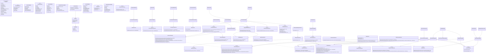

# Combined Class Diagram — UBB SE 2026

```mermaid
classDiagram
    direction TB

    %% ══════════════════════════════════════
    %%  MODELS & DTOs
    %% ══════════════════════════════════════

    class ReelModel {
        <<ObservableObject>>
        +int ReelId
        +int? MovieId
        +int? CreatorUserId
        +string VideoUrl
        +string ThumbnailUrl
        +string Title
        +string Caption
        +double FeatureDurationSeconds
        +string? CropDataJson
        +int? BackgroundMusicId
        +string Source
        +DateTime CreatedAt
        +DateTime? LastEditedAt
        +bool IsLiked
        +int LikeCount
    }

    class ReelUploadRequest {
        <<DTO>>
        +Stream VideoFileStream
        +string FileName
        +int UploaderUserId
        +int? MovieId
        +string? Caption
    }

    class MusicTrackModel {
        +int MusicTrackId
        +string TrackName
        +string Author
        +string AudioUrl
        +double DurationSeconds
        +string FormattedDuration
    }

    class VideoEditMetadata {
        <<DTO>>
        +int CropX
        +int CropY
        +int CropWidth
        +int CropHeight
        +int? SelectedMusicTrackId
        +double MusicStartTime
        +double MusicDuration
        +double MusicVolume
        +ToCropDataJson() string
    }

    class MovieCardModel {
        +int MovieId
        +string Title
        +string PosterUrl
        +string PrimaryGenre
        +string Genre
        +int ReleaseYear
        +string Synopsis
        +ToString() string
    }

    class UserMoviePreferenceModel {
        +int UserMoviePreferenceId
        +int UserId
        +int MovieId
        +double Score
        +DateTime LastModified
        +int? ChangeFromPreviousValue
    }

    class MovieModel {
        +int MovieId
        +string Title
        +string PosterUrl
    }

    class TournamentState {
        +List~Matchup~ PendingMatches
        +List~Matchup~ CompletedMatches
        +int CurrentRound
    }

    class Matchup {
        +MovieModel MovieA
        +MovieModel MovieB
        +int WinnerId
    }

    class UserProfileModel {
        +int UserProfileId
        +int UserId
        +int TotalLikes
        +long TotalWatchTimeSec
        +float AvgWatchTimeSec
        +int TotalClipsViewed
        +float LikeToViewRatio
        +DateTime LastUpdated
    }

    class MatchResult {
        <<DTO>>
        +int MatchedUserId
        +string MatchedUsername
        +float MatchScore
    }

    class UserReelInteractionModel {
        +int InteractionId
        +int UserId
        +int ReelId
        +bool IsLiked
        +int? WatchDurationSec
        +float? WatchPercentage
        +DateTime ViewedAt
    }

    %% ══════════════════════════════════════
    %%  REPOSITORIES & INFRASTRUCTURE
    %% ══════════════════════════════════════

    class ISqlConnectionFactory {
        <<interface>>
        +CreateConnectionAsync() Task
        +CreateMasterConnectionAsync() Task
    }

    class ReelRepository {
        +InsertReelAsync(ReelModel) void
        +BulkInsertScrapedReelsAsync(List~ReelModel~) void
        +GetReelsByMovieAndSourceAsync(int movieId, string source) List~ReelModel~
        +GetUserReelsAsync(int userId) Task~IList~ReelModel~~
        +GetReelByIdAsync(int reelId) Task~ReelModel?~
        +UpdateReelEditsAsync(int reelId, string cropDataJson, int? musicId, string? videoUrl) Task~int~
        +DeleteReelAsync(int reelId) Task
    }

    class IPreferenceRepository {
        <<interface>>
        +GetPreferenceAsync(int userId, int movieId) Task~UserMoviePreferenceModel?~
        +UpsertPreferenceAsync(UserMoviePreferenceModel preference) Task
        +GetMovieFeedAsync(int userId, int count) Task~List~MovieCardModel~~
        +GetAllPreferencesExceptUserAsync(int excludeUserId) Task~Dictionary~int, List~UserMoviePreferenceModel~~~
        +GetUnswipedMovieIdsAsync(int userId) Task~List~int~~
    }

    class PreferenceRepository {
        +GetPreferenceAsync(int userId, int movieId) Task~UserMoviePreferenceModel?~
        +UpsertPreferenceAsync(UserMoviePreferenceModel preference) Task
        +GetMovieFeedAsync(int userId, int count) Task~List~MovieCardModel~~
        +GetAllPreferencesExceptUserAsync(int excludeUserId) Task~Dictionary~int, List~UserMoviePreferenceModel~~~
        +GetUnswipedMovieIdsAsync(int userId) Task~List~int~~
        +BoostPreferenceOnLikeAsync(int userId, int movieId) void
    }

    class InteractionRepository {
        +InsertInteractionAsync(UserReelInteractionModel) void
        +UpsertInteractionAsync(int userId, int reelId) void
    }

    class ProfileRepository {
        +GetUserProfileAsync(int userId) UserProfileModel
        +UpsertProfileAsync(UserProfileModel) void
    }

    class MovieRepository {
        +GetMoviesAsync(int count) List~MovieModel~
    }

    %% ══════════════════════════════════════
    %%  SERVICES
    %% ══════════════════════════════════════

    class IVideoStorageService {
        <<interface>>
        +UploadVideoAsync(ReelUploadRequest) ReelModel
        +ValidateVideoAsync(Stream) ValidationResult
    }

    class IWebScraperService {
        <<interface>>
        +ScrapeVideosForMovieAsync(string movieTitle) List~RawVideo~
    }

    class WebScraperBackgroundService {
        +ExecuteAsync() void
    }

    class VideoIngestionService {
        +IngestTrailersAsync() void
    }

    class IAudioLibraryService {
        <<interface>>
        +GetAllTracksAsync() Task~IList~MusicTrackModel~~
        +GetTrackByIdAsync(int musicTrackId) Task~MusicTrackModel?~
    }

    class AudioLibraryService {
        +GetAllTracksAsync() Task~IList~MusicTrackModel~~
        +GetTrackByIdAsync(int musicTrackId) Task~MusicTrackModel?~
    }

    class IVideoProcessingService {
        <<interface>>
        +ApplyCropAsync(string videoPath, string cropDataJson) Task~string~
        +MergeAudioAsync(string videoPath, int musicTrackId, double startOffsetSec, double musicDurationSec, double musicVolumePercent) Task~string~
    }

    class VideoProcessingService {
        +ApplyCropAsync(string videoPath, string cropDataJson) Task~string~
        +MergeAudioAsync(string videoPath, int musicTrackId, double startOffsetSec, double musicDurationSec, double musicVolumePercent) Task~string~
    }

    class ISwipeService {
        <<interface>>
        +UpdatePreferenceScoreAsync(int userId, int movieId, bool isLiked) Task
        +GetMovieFeedAsync(int userId, int count) Task~List~MovieCardModel~~
    }

    class SwipeService {
        +double LikeDelta = 1.0$
        +double SkipDelta = -0.5$
        +UpdatePreferenceScoreAsync(int userId, int movieId, bool isLiked) Task
        +GetMovieFeedAsync(int userId, int count) Task~List~MovieCardModel~~
    }

    class IMovieCardFeedService {
        <<interface>>
        +FetchMovieFeedAsync(int userId, int count) Task~List~MovieCardModel~~
    }

    class MovieCardFeedService {
        +FetchMovieFeedAsync(int userId, int count) Task~List~MovieCardModel~~
    }

    class TournamentLogicService {
        +GenerateBracket(List~MovieModel~) TournamentState
        +AdvanceWinner(TournamentState, int winnerId) TournamentState
    }

    class WinnerService {
        +BoostWinnerScoreAsync(int userId, int movieId) void
        +bool ScoreBoosted
    }    

    class IPersonalityMatchingService {
        <<interface>>
        +GetTopMatchesAsync(int userId, int limit) List~MatchResult~
    }

    class IReelInteractionService {
        <<interface>>
        +RecordViewAsync(int userId, int reelId, int watchDuration, float watchPct) void
        +ToggleLikeAsync(int userId, int reelId) void
        +GetInteractionAsync(int userId, int reelId) UserReelInteractionModel
    }

    class IEngagementProfileService {
        <<interface>>
        +RecalculateProfileAsync(int userId) void
        +GetProfileAsync(int userId) UserProfileModel
    }

    class IRecommendationService {
        <<interface>>
        +GetRecommendedReelsAsync(int userId, int count) List~ReelModel~
    }

    class IClipPlaybackService {
        <<interface>>
        +PlayClip(string videoUrl) void
        +PauseClip() void
        +ResumeClip() void
        +GetElapsedSeconds() int
        +PrefetchClip(string videoUrl) void
    }

    %% ══════════════════════════════════════
    %%  VIEWMODELS
    %% ══════════════════════════════════════

    class ObservableObject {
        <<abstract>>
        +event PropertyChanged
        #OnPropertyChanged() void
    }

    class ReelUploadViewModel
    class MovieTrailerPlayerViewModel
    class ReelGalleryViewModel
    class ReelsEditingViewModel
    class MusicSelectionDialogViewModel
    class MovieSwipeViewModel
    class TournamentSetupViewModel
    class TournamentMatchViewModel
    class TournamentResultViewModel
    class MatchListViewModel
    class MatchedUserDetailViewModel
    class ReelsFeedViewModel
    class UserProfileViewModel

    %% ══════════════════════════════════════
    %%  VIEWS
    %% ══════════════════════════════════════

    class ReelUploadView
    class MovieTrailerPlayerView
    class ReelsEditingPage
    class MovieSwipeView
    class SwipeResultSummaryView
    class TournamentSetupView
    class TournamentMatchView
    class TournamentResultView
    class MatchListView
    class MatchedUserDetailView
    class ReelsFeedView
    class ReelItemView

    %% ══════════════════════════════════════
    %%  RELATIONSHIPS
    %% ══════════════════════════════════════

    %% Inheritance / Interfaces
    AudioLibraryService ..|> IAudioLibraryService
    VideoProcessingService ..|> IVideoProcessingService
    PreferenceRepository ..|> IPreferenceRepository
    SwipeService ..|> ISwipeService
    MovieCardFeedService ..|> IMovieCardFeedService

    ReelGalleryViewModel --|> ObservableObject
    ReelsEditingViewModel --|> ObservableObject
    MusicSelectionDialogViewModel --|> ObservableObject
    MovieSwipeViewModel --|> ObservableObject

    %% Composition
    TournamentState --> Matchup
    Matchup --> MovieModel

    %% Service -> Repository
    IVideoStorageService --> ReelRepository
    VideoIngestionService --> ReelRepository
    SwipeService --> IPreferenceRepository
    MovieCardFeedService --> IPreferenceRepository
    IPersonalityMatchingService --> PreferenceRepository
    IReelInteractionService --> InteractionRepository
    IReelInteractionService --> PreferenceRepository
    IEngagementProfileService --> ProfileRepository

    %% Service Dependencies
    WebScraperBackgroundService --> VideoIngestionService
    VideoIngestionService --> IWebScraperService
    VideoProcessingService --> IAudioLibraryService

    %% ViewModel -> Service/Repo
    ReelUploadViewModel --> IVideoStorageService
    MovieTrailerPlayerViewModel --> ReelRepository
    ReelGalleryViewModel --> ReelRepository
    ReelsEditingViewModel --> ReelRepository
    ReelsEditingViewModel --> IVideoProcessingService
    ReelsEditingViewModel --> IAudioLibraryService
    MusicSelectionDialogViewModel --> IAudioLibraryService
    MovieSwipeViewModel --> ISwipeService
    TournamentSetupViewModel --> MovieRepository
    TournamentMatchViewModel --> TournamentLogicService
    TournamentResultViewModel --> WinnerService
    MatchListViewModel --> IPersonalityMatchingService
    MatchedUserDetailViewModel --> ProfileRepository
    MatchedUserDetailViewModel --> PreferenceRepository
    ReelsFeedViewModel --> IRecommendationService
    ReelsFeedViewModel --> IReelInteractionService
    ReelsFeedViewModel --> IClipPlaybackService
    UserProfileViewModel --> IEngagementProfileService

    %% View -> ViewModel
    ReelUploadView --> ReelUploadViewModel
    MovieTrailerPlayerView --> MovieTrailerPlayerViewModel
    ReelsEditingPage --> ReelsEditingViewModel
    ReelsEditingPage --> ReelGalleryViewModel
    ReelsEditingPage --> MusicSelectionDialogViewModel
    MovieSwipeView --> MovieSwipeViewModel
    SwipeResultSummaryView --> MovieSwipeViewModel
    TournamentSetupView --> TournamentSetupViewModel
    TournamentMatchView --> TournamentMatchViewModel
    TournamentResultView --> TournamentResultViewModel
    MatchListView --> MatchListViewModel
    MatchedUserDetailView --> MatchedUserDetailViewModel
    ReelsFeedView --> ReelsFeedViewModel
    ReelItemView --> ReelsFeedViewModel

```
